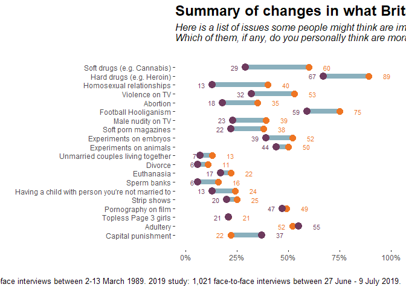

# 출처

* 제목 : Ipsos MORI Survey Dumbbell Graph
* 저자 : Anthony B. Masters
* 날짜 : 2019-10-30
* 링크 : https://rpubs.com/anthonybmasters/ipsos-mori-dumbbell-graph


# 개요

Ipsos MORI가 수행한 2개(30년 간격)의 설문조사(비도덕성에 대한 생각) 데이터를 이용하여 덤벨 그래프(dumbbell)를 그리는 것이다.

첫 번째 조사는 1989년 3월에 시행되었으며 1,458명의 성인이 응답하였다. 두 번째 조사는 2019년 6~7월에 시행되었으며 1,021명의 성인(15세 이상)이 응답하였다.

# 패키지 및 테마

패키지는 tidyverse와 ggalt가 사용된다.


```r
library(tidyverse)
library(readxl)
library(ggalt)
```

```
## Warning: package 'ggalt' was built under R version 4.0.2
```

그래프에 사용될 테마를 설정한다. 


```r
theme_clean <- theme_bw(base_family = "") +
  theme(legend.position = "top",
        legend.title = element_text(size = 12),
        legend.text = element_text(size = 12),
        plot.title = element_text(size = 18, face = "bold"),
        plot.subtitle = element_text(size = 12, face = "italic", margin = margin(b=12)),
        plot.caption = element_text(size = 10),
        panel.grid.major = element_blank(),
        panel.grid.minor = element_blank(),
        panel.border = element_blank())
theme_set(theme_clean)
```

코드의 간결성을 위해 퍼센트를 계산하는 사용자 함수를 만든다.


```r
percent_calc <- function(x) {
  x <- paste0(x*100)
  x
}
```

# 데이터 테이블 만들기

엑셀 파일을 불러오고, Issue 변수는 팩터화한다. 2019년 값이 1989년 값보다 작거나 같으면 1, 그렇지 않으면 -1로 표시되는 'Sgn'변수를 만든다.


```r
Ipsos_MORI_df <- read_excel("Ipsos MORI British Moral Attitudes - 2019-10-28.xlsx",
                            sheet = "DATA")
Ipsos_MORI_df$Issue <- factor(Ipsos_MORI_df$Issue, 
                              levels = rev(Ipsos_MORI_df$Issue))
Ipsos_MORI_df <- Ipsos_MORI_df %>% mutate(Sgn = sign(y1989 - y2019 + 0.005))
```

# 그래프 그리기


```r
Ipsos_Mori_gg <- ggplot(Ipsos_MORI_df, aes(y=Issue, x=y1989, xend=y2019)) +
  geom_dumbbell(size=3, color="#8AB0BD", colour_x = "#EE7523",
                colour_xend = "#6D3A5D", dot_guide = FALSE) +
  geom_text(data=filter(Ipsos_MORI_df, Issue=="Soft drugs (e.g. Cannabis)"),
            aes(x=y1989, y=Issue, label="1989"),
            color="#EE7523", size=5, vjust=-2,
            fontface="bold") + 
  geom_text(data=filter(Ipsos_MORI_df, Issue=="Soft drugs (e.g. Cannabis)"), 
            aes(x=y2019, y=Issue, label="2019"), 
            color="#6D3A5D", size=5, vjust=-2,
            fontface="bold") + 
  labs(x="", y="",
       title = "Summary of changes in what Britain sees as immoral",
       subtitle = "Here is a list of issues some people might think are immoral or morally wrong.\nWhich of them, if any, do you personally think are morally wrong?",
       caption = "Source: Ipsos MORI/King's College London. 1989 study: 1,458 face-to-face interviews between 2-13 March 1989. 2019 study: 1,021 face-to-face interviews between 27 June - 9 July 2019.") + 
  scale_y_discrete(expand = c(0.09,0)) + 
  scale_x_continuous(labels = scales::percent_format(accuracy = 1), 
                     limits = c(0,1)) + 
  geom_text(data=Ipsos_MORI_df, 
            aes(x=y1989, y=Issue, label=percent_calc(y1989)),
            color="#EE7523", size=3, 
            hjust=-Ipsos_MORI_df$Sgn*2) + 
  geom_text(data=Ipsos_MORI_df, 
            aes(x=y2019, y=Issue, label=percent_calc(y2019)),
            color="#6D3A5D", size=3, 
            hjust=Ipsos_MORI_df$Sgn*2)
```


```r
Ipsos_Mori_gg
```

<!-- -->

